# Secure SACCO

> Enterprise-grade SACCO Management System built with Spring Boot, React, PostgreSQL and Docker.

Secure SACCO is a modern, modular SACCO management platform designed to digitize cooperative financial operations. It provides comprehensive member management, savings, loans, accounting, meetings, reporting, user administration, and audit logging within a secure, scalable architecture.

<p align="center">
  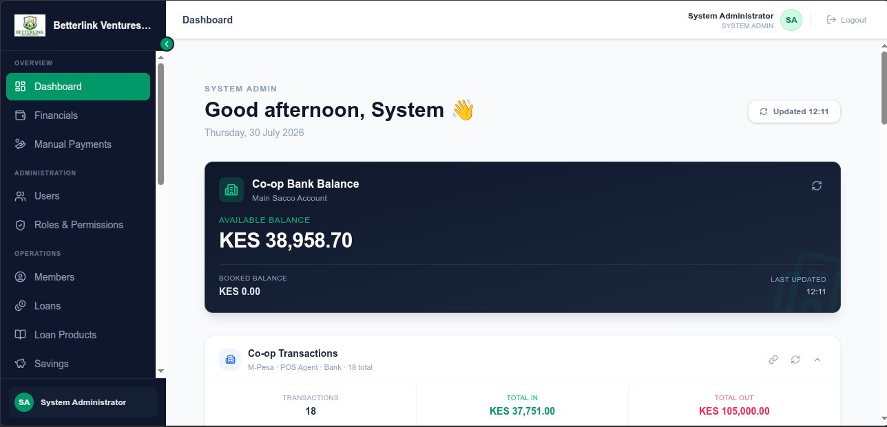
</p>


## ✨ Features

### 👥 Member Management
- Member registration and profile management
- Member directory with search and filtering
- Member account history
- Active and inactive member tracking

### 💰 Financial Management
- Savings management
- Loan processing and repayment tracking
- Accounting module
- Asset management
- Financial reporting

### 📅 Operations
- Meeting management
- User management
- Role & permission management
- Dashboard with key performance indicators

### 🔒 Security
- Authentication and authorization
- Role-Based Access Control (RBAC)
- Policy-Based Access Control (PBAC) ready
- Comprehensive audit trail
- Secure REST APIs

### ⚙️ Infrastructure
- Dockerized deployment
- PostgreSQL database
- Modular Spring Boot backend
- React + TypeScript frontend

## Overview

Secure SACCO is a modern enterprise-grade Savings and Credit Cooperative (SACCO) Management System designed to automate financial operations, member management, loan processing, accounting, asset tracking, governance, and auditing within cooperative societies.

The platform is built using a modern full-stack architecture with **Spring Boot**, **React**, **TypeScript**, **PostgreSQL**, and **Docker**, emphasizing scalability, security, maintainability, and modular domain-driven design.

### Core Capabilities

- Member Registration & Management
- Savings Management
- Loan Processing & Repayment
- Double-Entry Accounting
- Asset Management
- User & Role Management
- Fine-Grained Permission Management
- Comprehensive Audit Trails
- Meeting Management
- Financial Reporting
- Secure Authentication & Authorization
- Docker-based Deployment

---

## Screenshots

### Login

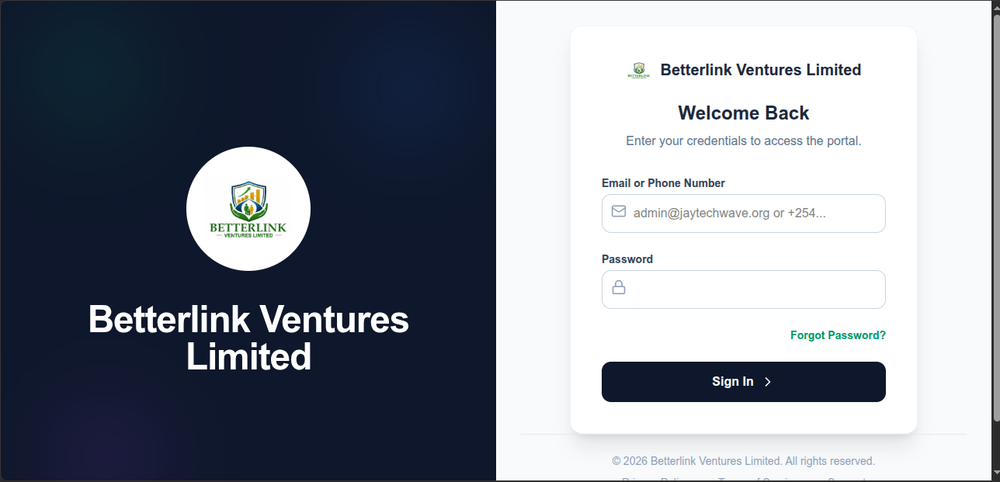

---

### Dashboard


---

### Member Management

| Member Directory | Member Registration |
|------------------|---------------------|
| 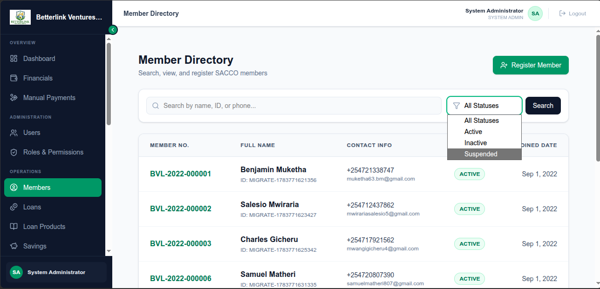 | 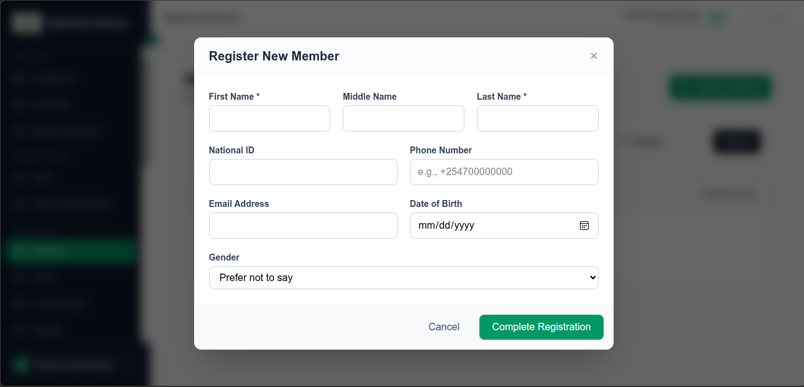 |

---

### Savings Management

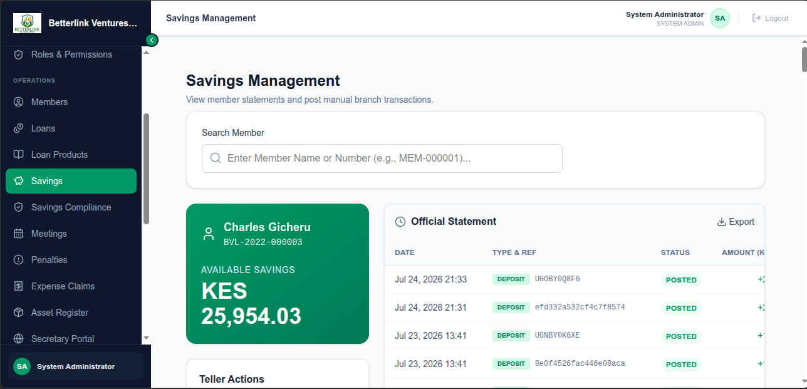

---

### Loan Management


---

### Accounting Module

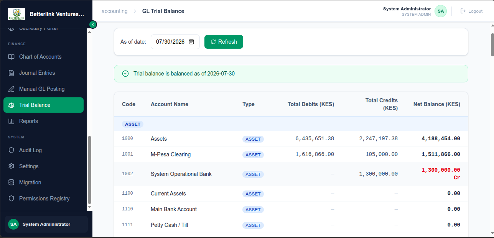

---

### Asset Management

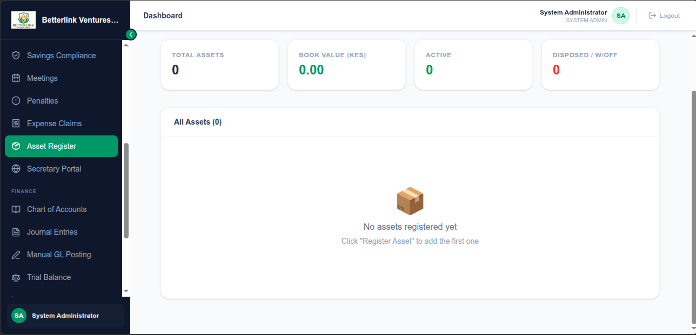

---

### User Management

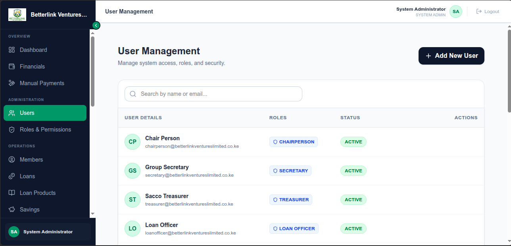

---

### Roles & Permissions

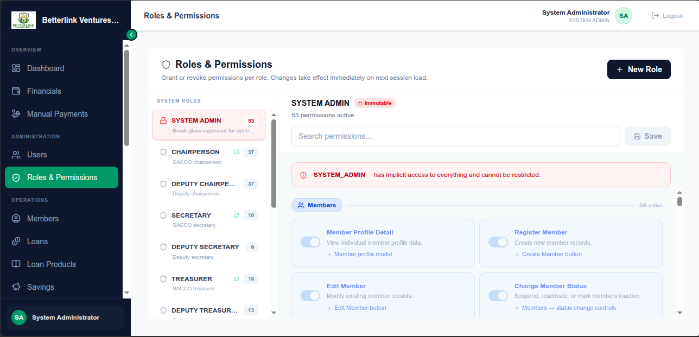

---

### Meetings Management

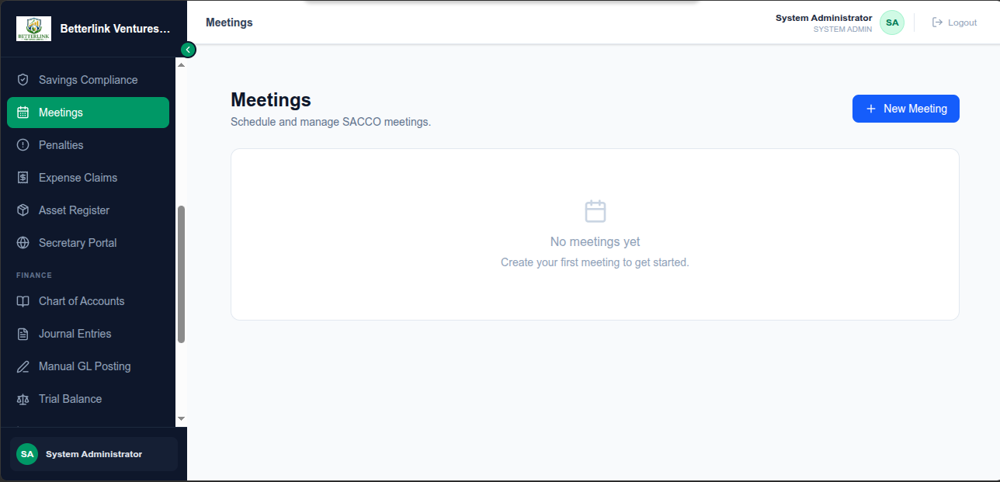

---

### Audit Trail

| Audit Logs | Detailed Audit |
|-------------|----------------|
| 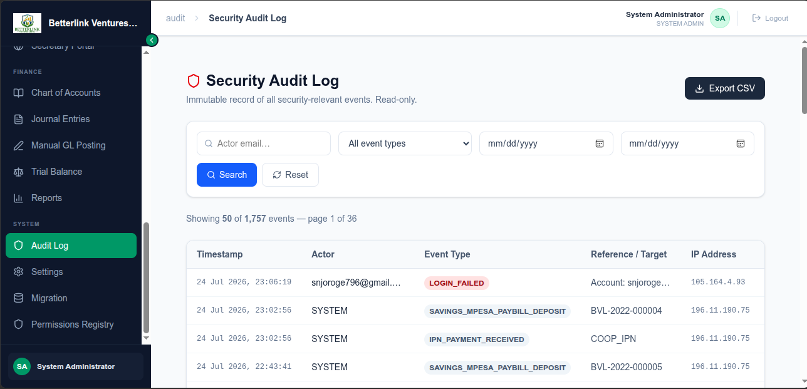 | 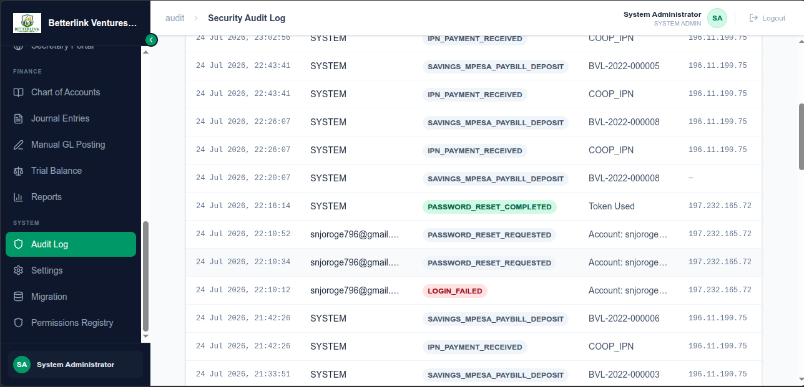 |

---

### Responsive Interface

| Desktop | Tablet | Mobile |
|----------|--------|--------|
| 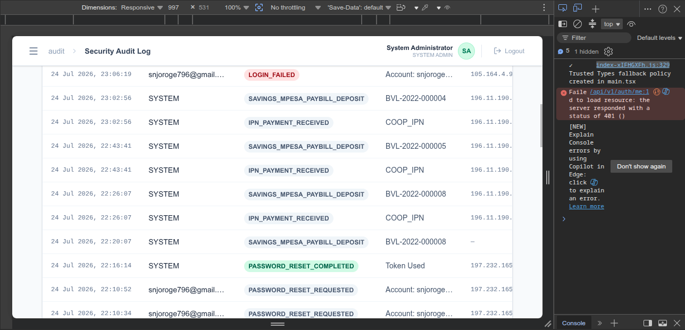 | 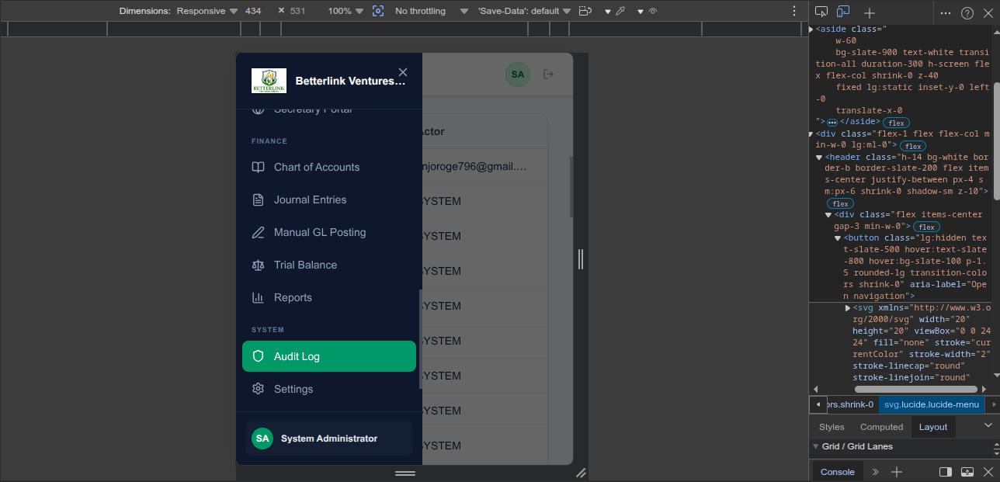 | 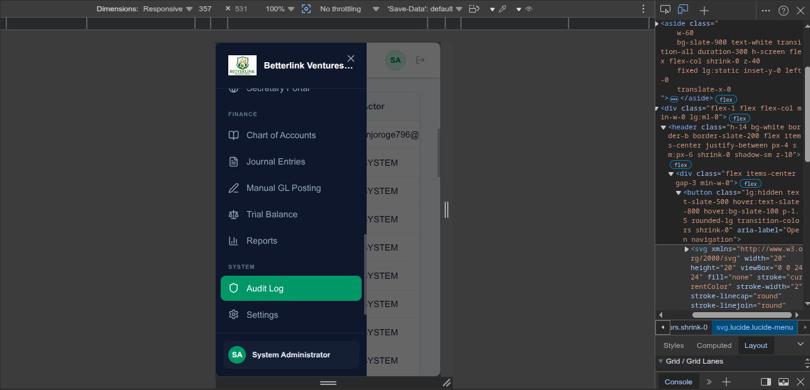 |

---

# Architecture

```
                    ┌───────────────────────────────┐
                    │         React 19 UI           │
                    │     TypeScript + Vite         │
                    └──────────────┬────────────────┘
                                   │ REST API
                    ┌──────────────▼────────────────┐
                    │     Spring Boot Backend       │
                    │      Modular Architecture     │
                    ├───────────────────────────────┤
                    │ Authentication               │
                    │ Members                      │
                    │ Savings                      │
                    │ Loans                        │
                    │ Accounting                  │
                    │ Assets                       │
                    │ Meetings                     │
                    │ Reports                      │
                    │ Audit                        │
                    └──────────────┬───────────────┘
                                   │
                          PostgreSQL Database
                                   │
                         Docker Compose Deployment
```

---

## Technology Stack

| Layer | Technology |
|--------|------------|
| Backend | Java 21 |
| Framework | Spring Boot 3 |
| Frontend | React 19 |
| Language | TypeScript |
| Database | PostgreSQL |
| Authentication | Spring Security + JWT |
| ORM | Spring Data JPA / Hibernate |
| Build Tool | Maven |
| Containerization | Docker & Docker Compose |
| Reverse Proxy | Nginx |
| Version Control | Git & GitHub |

---

## Project Structure

```text
secure-sacco/
├── backend/
│   ├── backend/          # Spring Boot application
│   ├── *.http            # API test collections
│   └── *.py              # Seeder utilities
│
├── frontend/             # React + TypeScript application
│
├── infra/                # Docker Compose
│
├── docs/                 # Public documentation
│   └── internal/         # Internal architecture & audit docs
│
├── scripts/              # Deployment & maintenance scripts
│
├── images/               # README screenshots
│
├── LICENSE
└── README.md
```

---

# Quick Start

## Prerequisites

Before running Secure SACCO, ensure you have the following installed:

| Software | Version |
|----------|---------|
| Java | 21+ |
| Maven | 3.9+ |
| Node.js | 20+ |
| npm | 10+ |
| PostgreSQL | 16+ |
| Docker | Latest |
| Docker Compose | Latest |
| Git | Latest |

---

## Clone the Repository

```bash
git clone https://github.com/jayrakel/secure-sacco.git
cd secure-sacco
```

---

## Backend Setup

Navigate to the backend:

```bash
cd secure-sacco/backend/backend
```

Install dependencies and build:

```bash
./mvnw clean install
```

Run the application:

```bash
./mvnw spring-boot:run
```

The backend will start on:

```
http://localhost:8080
```

---

## Frontend Setup

Open another terminal.

```bash
cd secure-sacco/frontend
```

Install dependencies:

```bash
npm install
```

Run the development server:

```bash
npm run dev
```

Frontend:

```
http://localhost:5173
```

---

## Docker Deployment

From the infrastructure directory:

```bash
cd secure-sacco/infra

docker compose up -d
```

To stop services:

```bash
docker compose down
```

---

## Build for Production

### Backend

```bash
./mvnw clean package
```

### Frontend

```bash
npm run build
```

---

## Running Tests

### Backend

```bash
./mvnw test
```

### Frontend

```bash
npm test
```

---

## Project Documentation

Documentation can be found in:

```
secure-sacco/docs/
```

Internal engineering and architecture documentation:

```
secure-sacco/docs/internal/
```

---

# ⚙️ Environment Configuration

Secure SACCO uses environment variables to configure the application for different environments.

## Backend

Create a `.env` file or configure the following environment variables:

| Variable | Description | Example |
|----------|-------------|---------|
| DB_HOST | PostgreSQL host | localhost |
| DB_PORT | PostgreSQL port | 5432 |
| DB_NAME | Database name | secure_sacco |
| DB_USERNAME | Database username | postgres |
| DB_PASSWORD | Database password | ******** |
| JWT_SECRET | Secret used for JWT signing | ******** |
| SERVER_PORT | Spring Boot server port | 8080 |

---

## Frontend

Create a `.env` file inside the frontend directory.

| Variable | Description | Example |
|----------|-------------|---------|
| VITE_API_BASE_URL | Backend API URL | http://localhost:8080/api |

---

## Example

Backend

```env
DB_HOST=localhost
DB_PORT=5432
DB_NAME=secure_sacco
DB_USERNAME=postgres
DB_PASSWORD=password

JWT_SECRET=your-secret-key

SERVER_PORT=8080
```

Frontend

```env
VITE_API_BASE_URL=http://localhost:8080/api
```

---

# 📡 API Documentation

Secure SACCO exposes a RESTful API consumed by the React frontend.

## Base URL

Development

```
http://localhost:8080/api
```

Production

```
https://your-domain.com/api
```

---

## Authentication

Most endpoints require a valid JWT access token.

Example:

```http
Authorization: Bearer <access_token>
```

---

## Core API Modules

| Module | Description |
|---------|-------------|
| Authentication | Login & token management |
| Members | Member lifecycle management |
| Savings | Savings accounts & transactions |
| Loans | Loan processing & repayments |
| Accounting | Financial records & journal entries |
| Assets | Asset management |
| Meetings | Meeting scheduling & records |
| Users | User administration |
| Roles | Roles & permissions |
| Audit | Audit trail & activity logs |

---

## API Testing

HTTP request collections and API test files are located in:

```
secure-sacco/backend/
```

These include:

- `.http` files
- Postman collections
- Seeder utilities

---

# Security

Secure SACCO is designed with security as a core principle.

- JWT Authentication
- Role-Based Access Control (RBAC)
- Policy-Based Access Control (PBAC) migration ready
- Comprehensive Audit Logging
- Password Encryption
- Input Validation
- Transaction Integrity
- Secure REST APIs

---

# Roadmap

- [x] Member Management
- [x] Savings Management
- [x] Loan Management
- [x] Accounting Module
- [x] Asset Management
- [x] Meeting Management
- [x] Audit Trail
- [x] Docker Deployment
- [x] Responsive UI
- [ ] Multi-Branch Support
- [ ] Mobile Application
- [ ] SMS Gateway Integration
- [ ] Email Notifications
- [ ] Analytics Dashboard
- [ ] Public REST API

---

# Contributing

Contributions are welcome.

1. Fork the repository.
2. Create a feature branch.

```bash
git checkout -b feature/my-feature
```

3. Commit your changes.

```bash
git commit -m "Add my feature"
```

4. Push your branch.

```bash
git push origin feature/my-feature
```

5. Open a Pull Request.

---

# License

This project is licensed under the MIT License.

See the [LICENSE](LICENSE) file for details.

---

# Author

**Nathan Gesora**

Founder, Jay Techwave Solutions

GitHub:
https://github.com/jayrakel

---

If this project is useful, consider giving it a ⭐ on GitHub.

---

## Project Statistics

| Metric | Value |
|---------|------:|
| Backend | Spring Boot 3 |
| Frontend | React 19 + TypeScript |
| Database | PostgreSQL |
| API Style | REST |
| Authentication | JWT |
| Architecture | Modular Monolith |
| Deployment | Docker Compose |
| License | MIT |

## Feature Gallery

| | |
|---|---|
|  |  |
|  |  |
|  |  |
|  |  |
|  |  |


<p align="center">
Built with Spring Boot • React • PostgreSQL • Docker
</p>
